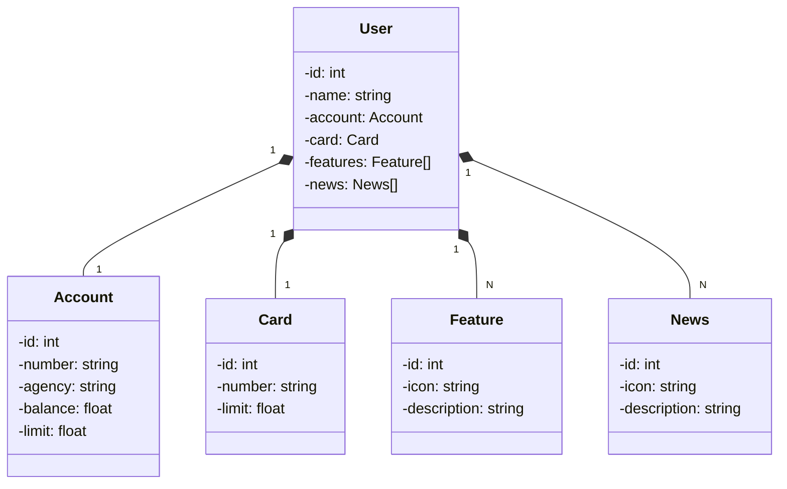

# java-api-rest
Desenvolvimento de uma API REST usando a linguagem Java

## Importante! 🚨
Eu ainda vou melhorar vários pontos dessa API, e corrigir alguns erros que estão acontecendo, como por exemplo toda vez que uma pessoa colocar um Json que seja igual a um existente no banco de dados, o id incrementa automaticamente mesmo sem ter nenhuma inserção válida para o banco de dados. 
Eu decidi publicar agora pois o bootcamp Santander 2023 na DIO acaba amanhã (22/10/2023) e eu tenho que entregar este projeto para finalização do bootcamp 😣 

## Diagrama

### 💖 Agradecimentos 💖
Quero deixar gravado aqui o quão bom e enriquecedor foi esse bootcamp, consegui evoluir muito como programador ao decorrer das últimas semanas. 
<strong>Agradeço de coração ao <em>Santander</em> e a toda equipe da <em>DIO</em> por essa oportunidade única na minha relativamente recente trilha como um desenvolvedor!<strong>💓
